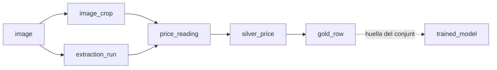

# Modelo de datos y linaje

Cómo se guarda cada precio y cómo se responde de dónde salió. Parte de la
documentación; el índice está en [README.md](README.md).

## La pregunta que justifica todo esto

Ante una predicción mala hay que poder saber si falló el modelo o si falló la
lectura de la imagen. Son dos problemas distintos, con dos soluciones distintas,
y desde fuera se ven exactamente igual.

Para contestarla, cada valor que llega al conjunto de modelado tiene que poder
seguirse hacia atrás hasta el recorte de píxeles del que salió, con qué versión
del código y con qué configuración se leyó. Eso es el linaje, y es lo que
convierte una tabla de precios en algo defendible.

Un archivo tabular no puede responder eso. Por eso **la base de datos es la
fuente de verdad y los archivos que se escriben al lado son exportaciones**:
cómodas para abrir en una hoja de cálculo o publicar como artefacto, pero
incapaces de sostener la cadena.

## La cadena



Cada flecha es una clave foránea. El linaje no es un campo de texto que alguien
rellena: es la propia forma de los datos, y por eso no se puede desincronizar.

## Las tablas

### `image`

Una fotografía tal como llegó, sin editar.

| Campo | Para qué |
|---|---|
| `sha256` | La identidad. Sirve de deduplicación y de llave de caché |
| `original_name` | El nombre con el que llegó, que puede repetirse entre lotes |
| `source_uri` | De dónde se descargó, cuando viene de almacenamiento remoto |
| `captured_at` | Fecha real de captura, de los metadatos del archivo |
| `brand`, `station` | Para poder contestar si el precio varía según la marca |
| `blurred_faces` | Cuántas caras se difuminaron antes de procesar |

La huella es la identidad y no el nombre. El mismo archivo llegado por otra vía
o con otro nombre es la misma fotografía: si se duplicara, la serie contaría dos
veces el mismo precio.

### `image_crop`

La porción de píxeles de la que se leyó un precio.

No es solo un ahorro de cómputo, es la **evidencia**. Ante una lectura
sospechosa se puede abrir exactamente el recorte que la produjo.

`detection_method` distingue si la región se encontró por sus características
(`detected`) o si se cayó al encuadre calibrado (`calibrated`). Sin ese dato no
se puede separar un fallo de localización de uno de lectura al analizar los
rechazos, y son cosas muy distintas.

### `extraction_run`

Una pasada de extracción sobre una fotografía: con qué versión del paquete, con
qué motor y con qué huella de configuración.

Las corridas **se acumulan** a propósito, mientras que las imágenes y los
recortes no se duplican. Cada corrida es evidencia de una pasada distinta, y
comparar dos sobre la misma imagen es lo que dice qué cambió entre ellas.

`raw_payload` guarda el resultado tal cual en columna de documento: si mañana la
extracción devuelve un campo nuevo, queda registrado sin migrar el esquema.

### `price_reading`

Un precio leído, o el motivo por el que no se pudo leer. Es la capa Bronze.

**Aquí no se corrige ni se rellena nada.** Es fiel a lo que dio la imagen. Las
lecturas inválidas se conservan con su motivo, porque saber cuántas fallaron y
por qué es lo que permite mejorar la extracción.

`ocr_engine` va por lectura y no solo por corrida: dentro de una misma
fotografía cada panel puede resolverse con un motor distinto, porque se queda el
de mayor confianza.

### `silver_price`

Un precio limpio, ya fechado y listo para la serie.

Aquí sí puede haber valores que no salieron de una lectura directa: la
reconstrucción aritmética produce filas legítimas. El campo `method` dice
siempre cuál es cuál.

### `gold_row`

Una fila del conjunto de modelado, con sus variables en columna de documento.

`source` distingue lo medido de lo generado, y `silver_price_id` enlaza con el
precio del que salió cuando existe. Una fila sintética no tiene enlace, y eso
mismo la identifica.

### `trained_model`

Cierra la cadena. Sin la huella del conjunto que lo produjo, el linaje termina
en los datos y no llega hasta la predicción.

## Cómo se obtuvo cada valor

El campo `method` recorre toda la cadena. Distinguir una medida de un valor
reconstruido o rellenado no es un detalle: **una fila imputada que no se
distingue de una medida es una mentira con formato de dato**.

| Método | Qué significa | Dónde puede aparecer |
|---|---|---|
| `ocr` | Se leyó de la imagen | Bronze en adelante |
| `arithmetic` | Se reconstruyó del total pagado y el volumen | Silver en adelante |
| `interpolated` | Se estimó entre dos observaciones | Gold |
| `median_imputed` | Se rellenó con la mediana del combustible | Gold |
| `mean_imputed` | Se rellenó con la media del combustible | Gold |
| `synthetic` | Fila generada, sin medida detrás | Gold |

Nunca se hereda el método de una lectura para una fila que nadie leyó. Si eso
pasara, el resto del registro de procedencia dejaría de servir para nada.

## Recuperar lo que no se pudo leer

Con fotografías tomadas en la calle siempre habrá lecturas que no salgan, y ese
es el estado normal, no una avería. Lo que decide la calidad del caso no es leer
el cien por cien sino qué se hace con lo que falta.

### Reconstrucción aritmética

La fotografía suele traer más de un dato: el volumen cargado y el total pagado.
Con esos dos el precio unitario sale por división, sin inventar nada.

$$
p = \frac{\text{total pagado}}{\text{galones cargados}}
$$

Dos comprobaciones que evitan errores silenciosos:

- **Conversión de unidad.** Si el dispensador marca litros y se divide como si
  fueran galones, el precio sale casi cuatro veces menor y dentro de un rango
  que parece plausible. Nadie lo notaría.
- **Cota sobre el resultado.** Una división perfectamente válida puede dar Q395
  por galón si el total se leyó mal. Sin la comprobación, ese número entra en la
  serie como bueno.

### Relleno estadístico

Cuando no hay redundancia que explotar, se estima a partir de la propia serie.
Aquí sí se pone un número donde no había medida, y por eso la marca importa.

| Estrategia | Cuándo | Límite |
|---|---|---|
| `interpolate` | Huecos entre observaciones. Lo natural en precios, que se mueven poco entre semanas | No cubre los extremos: no hay nada al otro lado |
| `median` | Huecos largos o en los bordes | Ignora la tendencia |
| `mean` | Solo si la serie no tiene tendencia | Rara vez aplica en precios |

Tres reglas, todas cubiertas por pruebas porque son donde se cuelan los errores
que nadie ve:

- **Solo se marca lo que se rellenó.** Una fila medida nunca queda marcada como
  estimada.
- **No se rellena sin nada medido.** Si un combustible no tiene ni un valor
  real, el hueco se queda: no hay de dónde estimarlo.
- **No se mezclan combustibles.** Rellenar un hueco de súper con precios de
  diésel daría un valor que no corresponde a ninguno de los dos.

## Consultar el linaje

```python
from fuel_price_gt.db import session_scope
from fuel_price_gt.db.lineage import trace_price, lineage_coverage
from datetime import date

with session_scope() as session:
    rastro = trace_price(session, date(2026, 8, 15), "regular")
    if rastro.reaches_photograph:
        print(rastro.image["original_name"], rastro.crop["path"])
    else:
        print("cadena incompleta:", rastro.breaks)

    print(lineage_coverage(session))
```

`breaks` declara las rupturas en vez de dejar huecos en blanco. Una fila
sintética no tiene fotografía detrás, y eso es una respuesta legítima.

`lineage_coverage` mide qué porcentaje del conjunto se puede rastrear hasta una
foto. Es la medida de salud del caso: **si da cero, el modelo se entrena solo
sobre datos generados**, y conviene que eso sea un número y no una advertencia
en prosa.

Desde el navegador:

```bash
make db-browser   # explorador en el puerto 19030
```

## No repetir trabajo caro

Leer una fotografía cuesta segundos; con un histórico de varios años, horas. La
extracción comprueba antes de procesar si esa imagen ya se leyó **con el mismo
código y la misma configuración**, y si es así la omite.

La comprobación va contra las tres cosas a la vez, y eso es deliberado: basta
que cambie un umbral de confianza para que la lectura pueda dar otro resultado,
y entonces sí hay que rehacerla.

```bash
make extract   # primera vez:  images_processed 5, skipped_cached 0
make extract   # sin cambios:  images_processed 0, skipped_cached 5
```

La huella del archivo se calcula igualmente, porque es lo que identifica la
imagen y es barato. Lo que se evita es el reconocimiento, que es la parte cara.

## Qué se guarda dónde

| Dato | Base | Archivo | Motivo |
|---|---|---|---|
| Fotografías | Referencia | `data/raw` | Los binarios no van en la base |
| Recortes | Referencia y caja | `data/interim` | Igual, pero la caja sí |
| Bronze | Sí, con documento crudo | Exportación por corrida | La base sostiene el linaje |
| Silver | Sí | Exportación | — |
| Gold | Sí, con variables | Exportación | — |
| Modelos | Metadatos y huella | `models/trained` | Los pesos no van en la base |

Regla general: **la base guarda lo que permite responder preguntas; el disco
guarda lo que pesa.**
