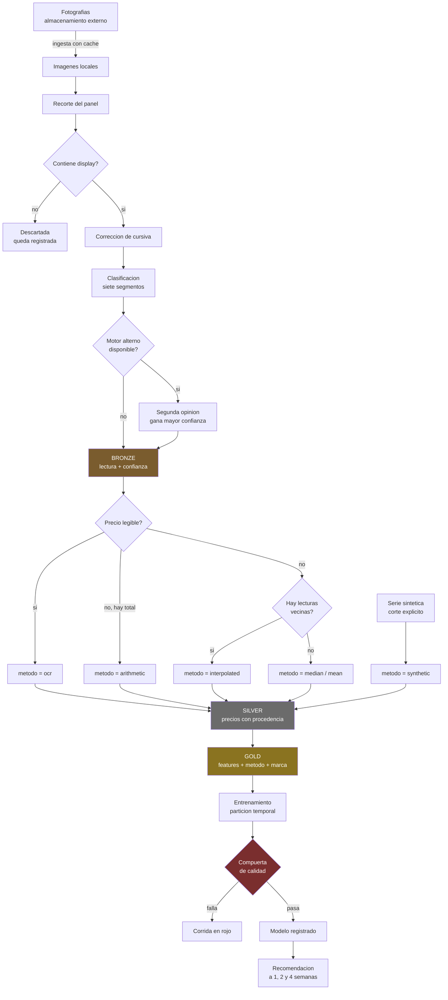
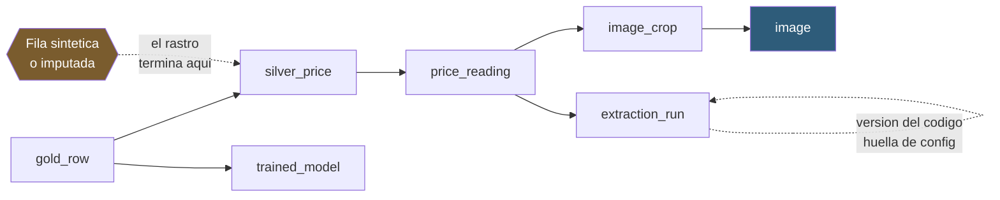
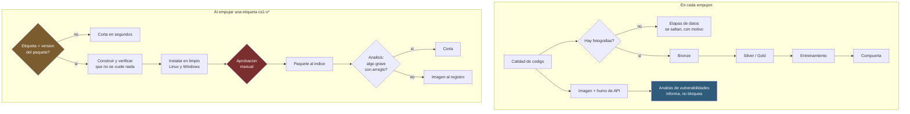

# El flujo completo

De la fotografía a la recomendación, y de ahí a lo publicado. Parte de la
documentación; el índice está en [README.md](README.md).

Son tres diagramas y no uno. Uno solo con todo se vuelve ilegible, y las tres
cosas que describen son independientes: por dónde pasa un dato, cómo se rastrea
hacia atrás, y cómo sale una entrega.

## 1. El dato, de la foto al consejo

Dos cosas que el dibujo hace explícitas y el texto esconde:

- **La columna `metodo` nace en Silver y llega hasta el modelo.** No es
  metadato: es una entrada. Un precio imputado y uno leído no valen lo mismo, y
  el modelo no puede distinguirlos si nadie se lo dice.
- **La compuerta corta.** No informa. Un pipeline en verde con un modelo que no
  gana a la referencia simple es peor que uno en rojo.

## 2. El rastro hacia atrás

Lo anterior visto al revés: desde un número del conjunto de modelado hasta la
fotografía de la que salió.

El encadenamiento son claves foráneas, no un campo que alguien mantiene: por eso
no se puede desincronizar. La base fuerza esa integridad en cada conexión, algo
que el motor embebido no hace salvo que se le pida explícitamente.

Cuando el rastro se corta —una fila sintética no tiene fotografía detrás— la
consulta **lo declara** en vez de devolver un hueco. Y `lineage_coverage` mide
qué porcentaje del conjunto llega hasta una foto real: si da cero, el modelo se
entrena solo sobre datos generados, y conviene que eso sea visible y no una
sorpresa.

## 3. Cómo sale una entrega

Tres decisiones que el dibujo explica mejor que un párrafo:

- **La ausencia de fotografías no es un fallo.** Se decide una vez, se deja
  escrito el motivo en el resumen, y las etapas que dependen de datos se saltan.
  Un pipeline verde que en realidad no ejecutó nada es peor que uno rojo.
- **La imagen sale después del paquete, no en paralelo.** Si la aprobación se
  rechaza, una imagen ya publicada anunciaría una versión que no existe en el
  índice.
- **El análisis corta al publicar y solo informa a diario.** La mayor parte de
  lo que encuentra son paquetes de la distribución sin arreglo publicado: cortar
  por algo que nadie puede arreglar entrena a ignorar el rojo.

## Dónde está cada cosa

| Del diagrama | En el código |
|---|---|
| Ingesta con caché | `ingestion/` |
| Recorte y lectura | `extraction/` |
| Bronze, Silver, Gold | `data/pipeline.py` |
| Recuperación y relleno | `data/recovery.py` |
| Las siete tablas | `db/models.py` |
| El rastro hacia atrás | `db/lineage.py` |
| Entrenamiento y compuerta | `modeling/`, `evaluation/` |
| Recomendación y servicio | `serving/` |

El detalle del modelo de datos está en [06_data_model.md](06_data_model.md), y
el de los flujos en [09_ci.md](09_ci.md).
