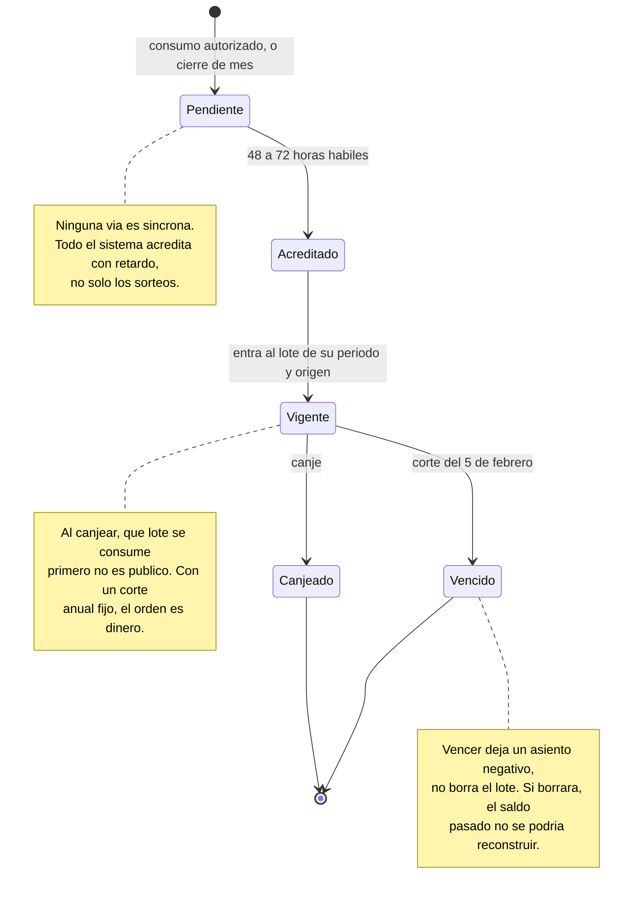
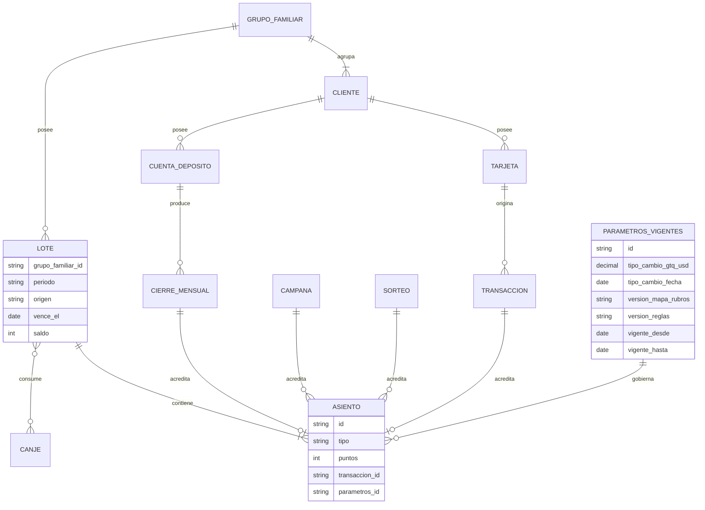

# Arquitectura de datos

Cuatro diagramas. El grande es el entregable que recibe el cliente; los tres de
detalle se leen dentro de este documento.

| Diagrama | Herramienta | Archivo |
| --- | --- | --- |
| Arquitectura de datos del sistema | draw.io | [`diagrams/arquitectura-datos-puntos-bi.drawio`](diagrams/arquitectura-datos-puntos-bi.drawio) |
| Ciclo de vida del punto | Mermaid | En este documento |
| Modelo de datos | Mermaid | En este documento |
| Flujo del dato en la réplica | Mermaid | En este documento |

El criterio de herramienta: draw.io para el que el cliente recibe suelto y no
cabe en un documento, Mermaid para los que se leen en línea y no exigen abrir
nada.

## El diagrama principal

Se abre en [app.diagrams.net](https://app.diagrams.net) o con la extensión de
draw.io en Visual Studio Code. El archivo es XML, así que se revisa en un diff
como cualquier código: si alguien mueve una caja, se ve.

Se genera con
[`../../scripts/gen_diagrama_arquitectura.py`](../../scripts/gen_diagrama_arquitectura.py),
que calcula las coordenadas en vez de fijarlas a mano. Eso permite reacomodar el
diagrama sin rehacerlo y verificar por programa que ninguna caja se solapa.

### Cómo se lee

El diagrama codifica el nivel de confianza en la forma, y además lo dice en el
rótulo de cada caja. Las dos cosas, porque una convención de color se pierde al
imprimir en blanco y negro.

| Señal | Significado |
| --- | --- |
| Borde continuo | **Público**: citable de una fuente de Corporación BI |
| Borde discontinuo | **Inferido**: se deduce de algo publicado, pero no está enunciado así |
| Relleno rojo | El dato **no es público**, o el punto **no se puede reconstruir** |
| Flecha discontinua roja | Camino que no se puede rederivar desde las transacciones |

### Qué dice el diagrama que el folleto no

Tres cosas, y son las que justifican que el entregable sea un diagrama y no una
lista:

**Ocho vías comerciales colapsan en cuatro orígenes técnicos.** El banco comunica
ocho formas de ganar puntos. Vistas desde los datos son cuatro sistemas, y seis de
las ocho vías comparten la misma tubería. La consecuencia práctica: cambiarle la
tasa a una de ellas no requiere tocar las otras tres.

**Una acreditación no es función del consumo.** Es función del consumo **y** de
cuatro estados externos consultados en el instante de acreditar: membresía Club Bi
vigente, servicio Bi Móvil activo, que la tarjeta acumule y que la afiliación
Mastercard se haya solicitado. Ninguno viaja en la transacción. El motor tiene que
ir a buscarlos a sistemas que no son el autorizador, y eso significa que la misma
transacción acredita distinto según cuándo se procese.

**Seis canales leen el saldo y tres lo ejecutan, pero toda la documentación
pública describe uno solo.** Es H-8.

### Qué corrige respecto del PDF anterior

`diagrams/Arquitectura de Datos - Puntos Bi (Banco Industrial) .pdf` fue el primer
borrador y sirvió como mapa de cajas. Presenta como hechos cuatro cosas que el
catálogo de evidencia no respalda, y el diagrama nuevo las corrige:

| El PDF dice | Lo que dice la evidencia |
| --- | --- |
| "Motor de reglas: tasa por tier (14-15 pts/US$10)" | La categoría de tarjeta **no cambia la tasa, cambia el tope anual**. La tasa es 1 punto por US$1, o 1 por US$10 en cinco rubros |
| "1595 pts = Q100" | 1,615 puntos, leído el 22 de septiembre de 2026 |
| "NeoNet: autorización y liquidación Visa/Mastercard" | Nombre de sistema interno que ninguna fuente pública confirma |
| "Motor de campañas ML (AWS/Azure/Spark/Python)" | Stack no público |

Los dos últimos son el mismo error y vale nombrarlo: **suponer la
infraestructura**. En un diagnóstico cuyo hallazgo crítico es que el banco
presenta como establecido lo que no está escrito, presentar nosotros un stack
inventado como parte del sistema destruiría el argumento. Por eso el diagrama
nuevo no nombra ningún producto de infraestructura, y lo dice en su subtítulo.

El PDF conviene retirarlo del repositorio cuando el equipo lo acuerde, para que no
circule como entregable. Es archivo de otra persona, así que es conversación antes
que borrado.

### Exportar a imagen

El reporte debe enlazar una imagen y no el archivo fuente, para que se vea sin
instalar nada. La exportación es un paso manual: abrir el `.drawio`, **Archivo,
Exportar como, PNG**, con un factor de escala de 2, y guardar en
[`exports/`](exports/) con el mismo nombre base. No está automatizado y conviene
saberlo antes de la entrega.

## Ciclo de vida del punto

Cuatro estados y dos salidas. Lo que no es evidente es que **vencer no borra**.

La transición a **Vencido** es la que más cuesta al cliente y la peor comunicada.
El corte es en fecha fija por año de acumulación, así que la vigencia efectiva va
de 13 a 25 meses según el mes en que se ganó el punto, y el programa la comunica
como "dos años" a todos por igual. Es H-3.

## Modelo de datos

El grano del ledger es **grupo familiar por periodo por origen**, y esa elección
carga todo el diseño. Por grupo porque el saldo pertenece a una unificación y solo
el titular puede canjear; por periodo porque el vencimiento es un corte anual; por
origen porque el valor de canje depende del producto que generó el punto.

Dos decisiones del modelo merecen explicación, porque son las que el sistema real
no tiene y son la propuesta del caso:

**Todo movimiento es un asiento.** Acreditar, vencer y canjear son asientos con
signo, no cambios a un número. Un saldo es la suma de sus asientos. Con eso, el
saldo a cualquier fecha pasada se reconstruye recorriendo la historia, y vencer no
destruye la evidencia de lo que existió.

**`PARAMETROS_VIGENTES` es la entidad que cierra H-4 y H-7.** Cada asiento apunta
a la versión de los parámetros con los que se calculó: el tipo de cambio y su
fecha, la versión del mapa de rubros, la versión de las reglas. Sin esa referencia,
un saldo no es reproducible ni teniendo las reglas en la mano, porque no se sabe
con qué números se calculó. Es la traducción concreta de lo que
[`../versionado-de-datos.md`](../versionado-de-datos.md) concluye con la matriz B:
el archivo versionado es la fuente y esta tabla es su despliegue.

**Lo que el modelo no puede arreglar:** los asientos originados en `SORTEO` no
tienen `transaccion_id`. No hay nada de qué derivarlos. Lo más que se puede lograr
es que tengan procedencia propia —identificador del sorteo, del premio y de la
notificación— para que sean verificables aunque no sean derivables. Es H-7, y es
el único lugar del diseño donde la respuesta es mitigar y no resolver.

## Flujo del dato en la réplica

Lo que el POC ejecuta. Los defectos de la izquierda no son accidentes del
simulador: se inyectan a propósito y a tasas declaradas, porque un motor que solo
se prueba con datos limpios no demuestra nada.

```mermaid
flowchart LR
    subgraph B["Bronze — como entra"]
        direction TB
        B1["Consumos con reintentos<br/>del autorizador, 3%"]
        B2["Reversas como fila<br/>aparte, 2%"]
        B3["Sin codigo de rubro, 12%"]
        B4["Liquidados en dolares, 8%"]
        B5["Fuera de orden, 5%"]
        B6["Cierres mensuales<br/>de saldo promedio"]
    end

    subgraph S["Silver — resuelto"]
        direction TB
        S1["Deduplicar por<br/>clave de autorizacion"]
        S2["Aplicar reversas"]
        S3["Resolver rubro:<br/>mapa inferido"]
        S4["Convertir moneda:<br/>tasa supuesta"]
        S5["Ordenar por evento"]
    end

    subgraph G["Gold — el ledger"]
        direction TB
        G1["Aplicar tasa segun rubro"]
        G2["Consultar elegibilidad"]
        G3["Aplicar topes"]
        G4["Emitir asientos<br/>con procedencia"]
        G5["Lotes por grupo,<br/>periodo y origen"]
    end

    subgraph R["Resultados del notebook"]
        direction TB
        R1["Saldo por grupo"]
        R2["Cuanto cambia segun<br/>el grano del tope"]
        R3["Perdida por vencimiento<br/>segun el orden de lotes"]
        R4["Poder de compra<br/>segun el origen"]
    end

    B --> S --> G --> R

    style B fill:#fff2cc,stroke:#d6b656
    style S fill:#fff2cc,stroke:#d6b656
    style G fill:#d5e8d4,stroke:#82b366
    style R fill:#dae8fc,stroke:#6c8ebf
```

Los cuatro resultados de la derecha son el argumento del reporte, y los cuatro
existen para responder una pregunta abierta: R2 responde a P-1, R3 a P-4, R4 a
P-5. No son métricas del programa: son demostraciones de cuánto cambia la
respuesta según lo que el cliente conteste. Esa es la única forma honesta de
reportar sobre un sistema cuyos parámetros no se conocen.
