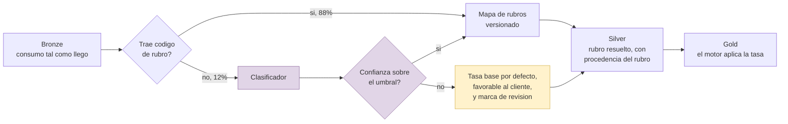

# Propuesta: dónde entra un modelo en el pipeline de datos

Cuarto entregable. Propone integrar un modelo en el pipeline de datos de Puntos
Bi, y dice cómo se sabría si vale la pena.

Empieza por lo que **no** propone: meter un modelo porque el proyecto pide un
modelo. En un sistema de acumulación de puntos, la mayor parte de la lógica es
determinista por diseño y debe seguirlo siendo. Un cliente tiene derecho a que la
regla que le acredita puntos sea una regla, no una predicción.

De ahí sale el criterio que ordena todo el documento:

> Un modelo entra solo donde una regla no alcanza, y solo si su error se puede
> acotar y medir.

Hay exactamente un lugar en el pipeline donde eso se cumple con claridad, y es el
que se propone.

## El problema que sí necesita un modelo

La decisión de aplicar la tasa base o la reducida depende de clasificar el
comercio. El banco nombra cinco categorías —supermercados, gasolineras, tiendas de
conveniencia, entidades de beneficencia y centros educativos— y **no publica el mapa
de códigos de rubro** que lleva de lo que trae la transacción a esas cinco
categorías.

Hay dos huecos distintos ahí, y solo el segundo es de modelado:

- **El mapa mismo no es público.** Eso no lo resuelve un modelo: lo resuelve
  preguntarle al cliente. Es parte de las preguntas abiertas.
- **Hay transacciones que llegan sin código de rubro.** El simulador del POC lo pone
  en 12%, que es un orden de magnitud realista para datos de autorización. Cuando
  el código falta, la regla no tiene con qué decidir.

Y la consecuencia de decidir mal es de diez a uno. Un comercio clasificado en la
categoría equivocada acumula la décima parte, o diez veces más. No es un error
estético: es el saldo de un cliente.

Hoy ese caso solo tiene dos salidas posibles, y las dos son malas: aplicar la tasa
base y regalar puntos que la regla no concede, o aplicar la reducida y quitarle al
cliente puntos que le corresponden. Ninguna de las dos es defendible ante un
reclamo, porque ninguna se apoya en nada.

## Los candidatos evaluados

Cuatro, con la misma matriz ponderada que usan las demás decisiones del caso. Los
pesos se declaran antes de puntuar.

| ID | Criterio | Peso | Por qué ese peso |
| --- | --- | --- | --- |
| M1 | Resuelve un problema que el diagnóstico demostró | 5 | Un modelo para un problema inventado es peor que ninguno |
| M2 | Hay dato de entrenamiento disponible | 5 | Sin dato no hay modelo, por mucho que el caso de uso guste |
| M3 | El error es tolerable y mitigable | 4 | El error cae sobre el saldo de un cliente |
| M4 | El beneficio se puede medir en unidades del negocio | 4 | Es la única forma de saber si valió la pena |
| M5 | Costo de implementación y operación | 2 | Importa, pero ninguno es caro |
| M6 | No exige recolectar datos personales adicionales | 2 | Es un banco: más datos es más riesgo |

| Candidato | M1 | M2 | M3 | M4 | M5 | M6 | **Total** |
| --- | --- | --- | --- | --- | --- | --- | --- |
| **C1. Clasificador del rubro faltante** | 5 | 5 | 4 | 5 | 4 | 5 | **104** |
| **C4. LLM con recuperación sobre el corpus de reglas** | 5 | 5 | 5 | 3 | 4 | 5 | **100** |
| C2. Detección de duplicados anómalos | 3 | 3 | 3 | 3 | 4 | 5 | 72 |
| C3. Propensión al canje | 3 | 2 | 4 | 4 | 3 | 2 | 67 |

Sensibilidad: C1 gana también si se sube el peso de la medibilidad, si se sube el de
la disponibilidad del dato, y con todos los pesos iguales. El orden entre los dos
primeros y los dos últimos no se invierte en ninguna variación.

Por qué pierden los dos de abajo:

- **C2, detección de duplicados anómalos.** Las reglas ya atrapan la mayoría: un
  reintento del autorizador comparte la clave de autorización y una reversa llega
  como fila con signo contrario. Lo que quedaría para un modelo es la cola, y no hay
  evidencia de que esa cola exista. Un modelo para un problema que no se demostró.
- **C3, propensión al canje.** Es el más atractivo comercialmente y el peor
  soportado. Exige histórico de canjes que no tenemos, que el banco no publica y
  que probablemente esté incompleto por los dos canales no documentados. Además
  obliga a perfilar clientes, lo que agrega riesgo de datos personales para un
  beneficio que no está establecido.

## La propuesta: C1, clasificador del rubro faltante

### Dónde entra en el pipeline

En **silver**, en el paso de resolución del rubro, antes de que el motor aplique
ninguna tasa. No en bronze, porque bronze debe conservar lo que llegó tal como
llegó; no en gold, porque ahí la tasa ya se aplicó.

La pieza que hace aceptable la propuesta no es el clasificador: es el rombo de la
derecha y la caja amarilla.

### El dato de entrenamiento ya existe

Es lo que vuelve a este candidato el único sólido: **el 88% de las transacciones
que sí traen código de rubro es el conjunto etiquetado.** No hay que construir
etiquetas, ni contratar anotadores, ni pedirle nada nuevo al cliente. El dato de
entrenamiento es un subconjunto del dato de producción.

Entradas razonables: nombre del comercio tal como llega en la transacción, monto,
hora y día, terminal o adquirente, y el histórico del mismo comercio si está
identificable. El nombre del comercio es la señal principal, y es texto corto y
ruidoso, que es un problema bien entendido.

### Cómo se mide, y cuándo se descarta

El criterio de descarte se fija **antes** de entrenar, para no moverlo después de
ver el resultado. Es la misma disciplina que CS1 aplicó a su lectura de dígitos.

| Medida | Umbral | Por qué ese |
| --- | --- | --- |
| Exactitud sobre las cinco categorías reducidas, en validación separada por tiempo | Mayor que la de la regla de respaldo | Si no gana a "aplicar siempre la tasa base", no tiene derecho a entrar |
| Cobertura: fracción del 12% que el modelo resuelve sobre el umbral de confianza | Al menos la mitad | Por debajo de eso el beneficio no compensa la complejidad de mantenerlo |
| Error en puntos: diferencia entre los puntos que acredita el modelo y los que acredita la etiqueta real, sobre el conjunto de prueba | Se reporta siempre | Es la única métrica en unidades que el cliente entiende |

La tercera es la que importa para el negocio y la que casi nunca se reporta. La
exactitud en porcentaje no le dice nada a un banco; "el modelo habría acreditado
4,100 puntos de más sobre 50,000 transacciones" sí.

La validación se separa **por tiempo**, no al azar: los comercios nuevos aparecen
con el tiempo, y una partición aleatoria deja el mismo comercio a los dos lados e
infla el resultado.

### Qué pasa si el modelo se equivoca

Es la pregunta que decide si la propuesta es responsable, y tiene tres respuestas
concretas:

**Un umbral de confianza, no una predicción obligatoria.** Por debajo del umbral el
modelo no decide: la transacción cae a la regla de respaldo.

**El respaldo es favorable al cliente.** Ante duda, tasa base. Cuesta puntos al
banco y no al cliente, y esa asimetría es deliberada: un error que perjudica al
cliente genera un reclamo que el banco no puede explicar, porque tendría que
explicar que un modelo decidió. Un error que favorece al cliente es un costo
acotado y medible.

**Cada rubro resuelto por el modelo queda marcado como tal.** El campo de
procedencia dice si el rubro vino de la transacción, del mapa o del modelo, y en el
último caso con qué versión del modelo y con qué confianza. Sin eso, un reclamo no
se puede investigar. Es la misma idea que sostiene la recomendación de
[`../architecture/README.md`](../architecture/README.md): el asiento guarda los
parámetros con los que se calculó.

Con las tres, el peor caso del modelo es que no resuelva nada y el sistema se
comporte como hoy. Eso es lo que hace que la propuesta sea integrable sin riesgo de
regresión.

### Lo que este modelo no debe hacer nunca

- **Decidir la tasa.** Decide el rubro; la tasa la aplica la regla. Son dos pasos
  separados a propósito, y el segundo tiene que seguir siendo auditable línea por
  línea.
- **Aprobar o denegar un canje.** Un canje es un derecho del cliente sobre un saldo.
- **Estimar un saldo.** El saldo es la suma de asientos. Si hiciera falta un modelo
  para saber el saldo, el problema sería el ledger.

## La propuesta complementaria: C4, un LLM sobre el corpus de reglas

Queda a cuatro puntos del primero y merece su lugar, con una aclaración: **no va en
el pipeline de datos.** No toca el ledger ni acredita nada. Va al lado, como
herramienta de consulta.

**Qué resuelve.** H-2 dice que la regla del programa no está escrita en ningún lado:
vive repartida en notas al pie de ocho páginas de producto, en las preguntas
frecuentes de dos programas distintos, en las bases de cada promoción y en un blog
de 2022. Reconstruirla exigió tres rondas de trabajo manual. Ese es un problema de
recuperación sobre texto disperso, que es exactamente lo que un modelo de lenguaje
con recuperación resuelve.

**Por qué es defendible.** El corpus ya existe y está delimitado: son las nueve
fuentes de [`../report/05-referencias.md`](../report/05-referencias.md) más el
propio [`../../config/assumptions.yaml`](../../config/assumptions.yaml). No hay que
recolectar nada.

**Y por qué su riesgo es bajo.** Un error no le quita puntos a nadie: produce una
respuesta mal citada. Con dos condiciones se vuelve verificable:

- **Cada respuesta cita la fuente y el fragmento.** Sin cita, no hay respuesta.
- **Responde "no está publicado" cuando corresponde**, en vez de completar el hueco.
  Es la regla del caso convertida en requisito del sistema, y es donde un modelo de
  lenguaje falla por defecto: su inclinación natural es contestar.

La segunda condición es la difícil, y es medible: se evalúa con las trece preguntas
abiertas del caso, cuya respuesta correcta es exactamente "eso no lo publica el
banco". Un modelo que conteste nueve de trece con una cifra inventada no sirve, y el
caso trae el examen ya escrito.

**Quién lo usaría.** Los asesores del Contact Center y de agencia, que son quienes
hoy responden preguntas sobre el programa sin un documento donde consultarlas. Y el
equipo que herede el sistema, que es el problema que el cliente ya tuvo una vez.

## Orden sugerido

| # | Paso | Por qué en ese orden |
| --- | --- | --- |
| 1 | Consolidar las reglas en un archivo versionado que el motor lea | Es la base de todo y no necesita ningún modelo. Ataca H-2 estructuralmente |
| 2 | Agregar procedencia al ledger: tipo de cambio, versión del mapa, versión de las reglas | Sin esto, ningún modelo es auditable. Ataca H-4 y H-7 |
| 3 | Medir cuántas transacciones llegan sin código de rubro | Si el número real es 1% y no 12%, C1 no vale la pena. Es una consulta, no un proyecto |
| 4 | C1, el clasificador, con umbral y respaldo favorable al cliente | Con 1 a 3 hechos, es incremental y reversible |
| 5 | C4, el asistente de consulta sobre las reglas | Depende del paso 1: el corpus consolidado es su insumo |

Los pasos 1 y 2 no son de machine learning y son los que más valen. Conviene decirlo
en la entrega: **la mayor parte del beneficio de esta propuesta se obtiene antes de
entrenar nada.** Un modelo montado sobre un ledger sin procedencia hereda
exactamente el problema que el diagnóstico encontró, y lo vuelve más difícil de
investigar.
