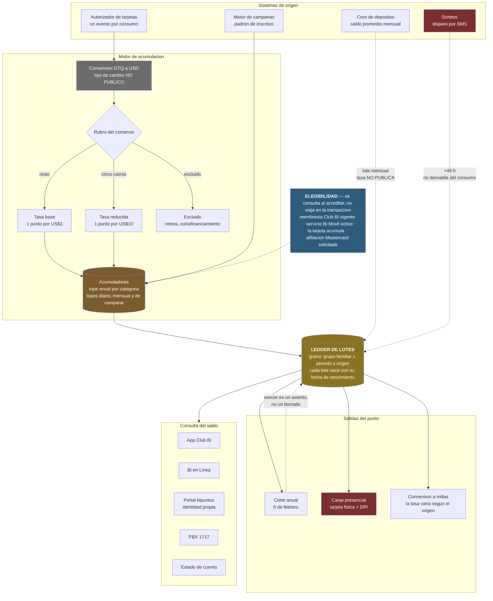

# Caso de Estudio 02 — Sistema de recompensas Puntos Bi (Club Bi)

Diagnóstico y documentación del sistema de lealtad de Corporación BI / Banco
Industrial reconstruido desde fuera.

El encargo parte de una premisa: **los responsables de diseñar e
implementar el programa ya no trabajan en la empresa.** No hay a quién
preguntarle. Así que este caso no empieza proponiendo optimizaciones; empieza
estableciendo qué hace el sistema y con qué evidencia se sostiene cada
afirmación.

Esa distinción gobierna todo el repositorio. Cada regla documentada lleva
escrito su nivel de confianza:

| Nivel | Qué significa |
|---|---|
| **público** | Citable de una fuente pública de Corporación BI. Se defiende sin matices |
| **inferido** | No publicado como tal, pero se deduce de algo que sí lo está |
| **supuesto** | Elegido por el equipo consultor. Ningún entregable lo presenta como dato del sistema |

El catálogo completo está en [`config/assumptions.yaml`](config/assumptions.yaml).
Es el archivo del que salen todos los demás.

## Lo que se encontró

La investigación devolvió más de lo esperado. Dos ejemplos de por qué:

**La tasa de acumulación es pública, pero no existe un lugar donde esté
escrita.** Vive en una nota al pie con asterisco, repetida en cada página de
producto. La página del programa no la menciona. Reconstruirla exigió cruzar
cuatro páginas de tarjeta distintas.

> Base: **1 punto por cada US$1 de compra**.
> Excepción: **1 punto por cada US$10** en supermercados, gasolineras, tiendas
> de conveniencia, entidades de beneficencia y centros educativos.

(Según lo que se menciona en la página de corporacion Bi, y en las páginas de las tarjetas de crédito que indican el sistema de puntos bi).

Esa excepción es una penalización de diez a uno sobre el gasto recurrente
típico de una tarjeta, . Son exactamente las cinco
categorías con tasa de intercambio regulada: el programa traslada su economía
al cliente sin decirlo.

**La categoría de tarjeta no cambia la tasa: cambia el techo.**

| Categoría | Tope anual |
|---|---|
| Mastercard Gold Internacional | 180,000 puntos |
| Visa Premier | 180,000 puntos |
| Visa Signature | 360,000 puntos |
| Visa Infinite | 420,000 puntos |

Es una decisión de diseño distinta de la habitual en la región, donde la
categoría multiplica la tasa. Aquí todos ganan lo mismo por dólar y las
categorías altas solo pueden seguir ganando durante más tiempo antes de topar.
Las demás categorías no publican tope alguno.

Los ocho hallazgos, con severidad y evidencia, están en
[`docs/report/03-hallazgos.md`](docs/report/03-hallazgos.md).

## Arquitectura de datos

El sistema no tiene una vía de acumulación, como se explico antes, tiene cuatro, y no se parecen en
nada entre sí. Una reacciona a un evento, otra a un cierre de mes, otra a una
campaña con vigencia y topes propios, y la cuarta a un sorteo que acredita
puntos que no se derivan de ningún consumo.



- **Las flechas punteadas son las que no se pueden reconstruir.** El saldo
  promedio llega por lote y sin tasa pública; el sorteo acredita con 48 horas
  de retraso desde un canal externo. Si se pierde su registro, no hay forma de
  rederivar esos puntos desde las transacciones. El resto del sistema sí es
  reproducible.
- **La elegibilidad no viaja en la transacción.** Membresía, Bi Móvil, padrón
  de inscritos y afiliación son estados que viven en otros sistemas y que el
  motor tiene que consultar en el instante de acreditar. Una acreditación no
  es una función del consumo: es una función del consumo y de cuatro estados
  externos en ese momento.
- **Seis canales leen el saldo y uno solo lo ejecuta**, y ese es presencial.

Los diagramas de detalle —flujo del dato, ciclo de vida del punto y modelo de
datos— están en [`docs/architecture/`](docs/architecture/).

## Qué hay en este caso

```
reward-system/
├── config/
│   └── assumptions.yaml          # catálogo de reglas, con fuente y confianza
├── docs/
│   ├── report/                   # el reporte escrito
│   ├── architecture/             # diagramas y su lectura
│   └── proposal/                 # propuesta de ML / AI / LLM en el pipeline
├── notebooks/                    # réplica en miniatura de la arquitectura
├── src/                          # el código del POC
├── tests/
└── data/                         # bronze / silver / gold (vacío en el repositorio)
```

La documentación se lee desde [`docs/README.md`](docs/README.md), que trae el
índice y una ruta sugerida según lo que se busque.

## Decisiones que conviene no deshacer sin querer

- **Ningún número del reporte aparece sin su nivel de confianza.** Es tentador
  redondear "1 punto por US$1" a un dato y seguir, pero la mitad del valor de
  este diagnóstico está en distinguir lo que el banco publica de lo que el
  equipo dedujo. Borrar esa marca convierte el reporte en una opinión bien
  formateada.
- **Lo que no se pudo averiguar se escribe como pregunta, no se rellena.** Las
  seis preguntas abiertas al final de `assumptions.yaml` son un entregable, no
  un hueco. Un diagnóstico que no distingue entre "no aplica" y "no lo sé" hace
  que el cliente descubra los huecos en producción.
- **La ausencia también se cita.** Cuando una fuente no dice algo, se registra
  como *ausencia verificada* con la fuente donde se buscó. Es lo que permite
  afirmar que cuatro categorías de tarjeta publican su tope y el resto no, en
  lugar de insinuarlo.
- **El grano del ledger es el grupo familiar, no el cliente.** Lo impone la
  unificación familiar: el saldo pertenece a un grupo y lo ejerce una persona.
  Cualquier análisis por cliente cuenta puntos que ese cliente no puede canjear.
