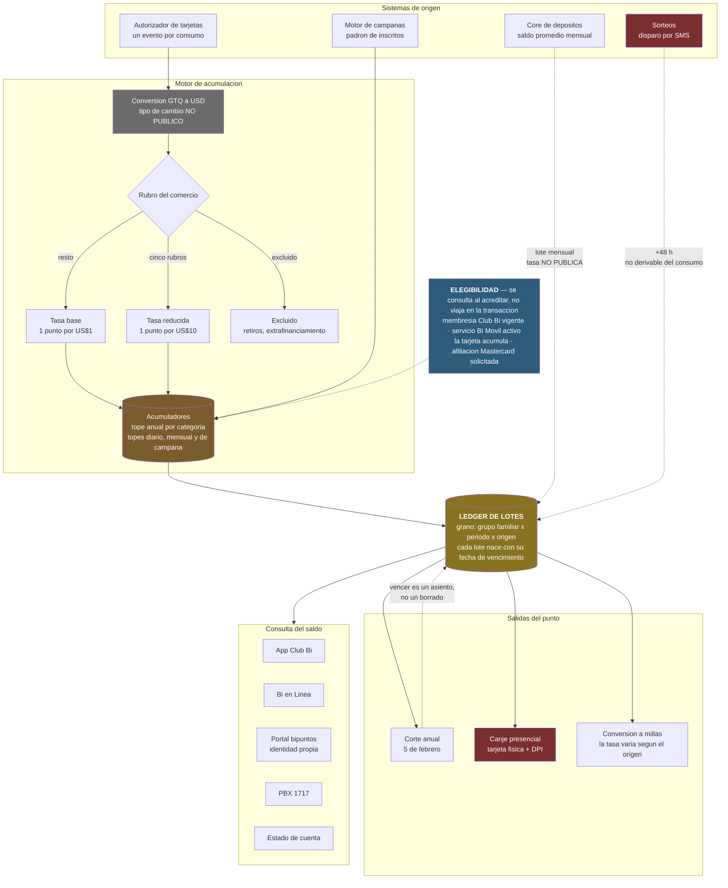

# Caso de Estudio 02 — Sistema de recompensas Puntos Bi (Club Bi)

Diagnóstico y documentación del sistema de lealtad de Corporación BI / Banco
Industrial reconstruido desde fuera.

El encargo parte de una premisa: **los responsables de diseñar e
implementar el programa ya no trabajan en la empresa.** No hay a quién
preguntarle. Así que este caso no empieza proponiendo optimizaciones; empieza
estableciendo qué hace el sistema y con qué evidencia se sostiene cada
afirmación.

Esa distinción gobierna todo el repositorio. Cada regla documentada lleva
escrito su nivel de confianza:

| Nivel | Qué significa |
|---|---|
| **público** | Citable de una fuente pública de Corporación BI. Se defiende sin matices |
| **inferido** | No publicado como tal, pero se deduce de algo que sí lo está |
| **supuesto** | Elegido por el equipo consultor. Ningún entregable lo presenta como dato del sistema |

El catálogo completo está en [`config/assumptions.yaml`](config/assumptions.yaml).
Es el archivo del que salen todos los demás.

## Lo que se encontró

La investigación devolvió más de lo esperado. Tres ejemplos de por qué:

**La tasa de acumulación es pública, pero no existe un lugar donde esté
escrita.** Vive en una nota al pie con asterisco, repetida en cada página de
producto. La página del programa no la menciona. Reconstruirla exigió cruzar
cuatro páginas de tarjeta distintas.

> Base: **1 punto por cada US$1 de compra**.
> Excepción: **1 punto por cada US$10** en supermercados, gasolineras, tiendas
> de conveniencia, entidades de beneficencia y centros educativos.

Esa excepción es una penalización de diez a uno sobre el gasto recurrente
típico de una tarjeta. Son exactamente las cinco categorías con tasa de
intercambio regulada: el programa traslada su economía al cliente sin decirlo.

**La categoría de tarjeta no cambia la tasa: cambia el techo.**

| Categoría | Tope anual |
|---|---|
| Mastercard Gold Internacional | 180,000 puntos |
| Visa Premier | 180,000 puntos |
| Visa Signature | 360,000 puntos |
| Visa Infinite | 420,000 puntos |

Es una decisión de diseño distinta de la habitual en la región, donde la
categoría multiplica la tasa. Aquí todos ganan lo mismo por dólar y las
categorías altas solo pueden seguir ganando durante más tiempo antes de topar.
Las demás categorías no publican tope alguno.

**Y la tarjeta no es la única forma de ganar puntos.** Hay ocho, y el consumo
con tarjeta es solo una.

## Cómo se ganan puntos

El programa premia el uso de productos Bi, no solo el consumo. La enumeración
más completa que publica el banco está en las preguntas frecuentes de Club Bi:

> ***¿Cómo acumulas Puntos Bi?** Utilizando las tarjetas de crédito y débito
> Visa, tarjetas débito MasterCard, Saldo promedio en Super Cuenta Monetaria y
> Ahorro, Cuenta Ahorro 5 Estrellas, todos los consumos que realizados con
> Divídelo Todo, consumiendo en comercios aliados (La Torre, Cemaco), Tarjetas
> de crédito MasterCard se deberá de solicitar por medio de agencia o Contact
> Center para acumular.*

Cruzada con la infografía del boletín del blog y con las páginas de cada
producto, queda así:

| # | Vía | Qué la dispara | Cifra pública |
|---|---|---|---|
| 1 | Tarjetas de crédito y débito **Visa** | Consumo | **Sí**: 1 pt/US$1, o 1 pt/US$10 en cinco rubros |
| 2 | Tarjetas de **débito Mastercard** | Consumo | No |
| 3 | Tarjetas de **crédito Mastercard** | Consumo, **solo si se solicita** por agencia o Contact Center | No |
| 4 | **Divídelo Todo** | Consumo | No |
| 5 | **Saldo promedio** en tres cuentas de depósito | Cierre de mes | **Parcial**: el umbral sí, la tasa no |
| 6 | **Comercios aliados** | Consumo con Tarjetas Bi en ciertos comercios | No |
| 7 | **Tarjeta Prepago Club Bi** | Consumo en +1,000 POS Visa | No |
| 8 | **Campañas y sorteos** | Promoción vigente | Sí, por campaña |

### Tener dinero guardado también acumula

Esta es la vía que menos se comunica y la que más cambia la naturaleza del
sistema: no premia gastar, premia **mantener saldo**. No reacciona a una
transacción sino a un cierre de mes.

El banco es explícito en que los movimientos no cuentan:

> ***¿Si realizo depósitos a mis cuentas Monetarias o de Ahorros, acumulo Bi
> Puntos?** No, recuerda que los depósitos a tus cuentas no acumulan Bi Puntos,
> acumulas Bi Puntos por los **saldos promedio** que mantienes…\**
>
> *\* Cada Cuenta tiene su propia Regla de Acumulación*

Depositar y retirar el mismo día no genera nada. Lo que genera puntos es el
promedio que queda al cerrar el mes, y cada cuenta tiene su propio umbral:

| Cuenta | Saldo promedio mensual desde el que acumula |
|---|---|
| Súper Cuenta de Ahorro | más de **Q500.00** |
| Súper Cuenta Monetaria | más de **Q1,000.00** |
| Cuenta de Ahorro 5 Estrellas | a partir de **Q1,000.00** |

Los tres umbrales son públicos, cada uno en la página de su producto. **Lo que
no es público es la tasa**: ninguna fuente dice cuántos puntos genera un saldo
promedio de cuánto, para ninguna de las tres cuentas. Y el asterisco de arriba
agrava el hueco, porque el banco reconoce por escrito que no hay una regla sino
**tres**, y no publica ninguna.

Sin esa tasa no se puede responder algo básico: **¿el programa premia gastar o
premia ahorrar?** Es la pregunta [P-2](config/assumptions.yaml).

**Hay además un multiplicador por membresía.** Pagar la membresía Club Bi
duplica los puntos que genera el saldo — y aquí las dos fuentes del banco no
coinciden en cuál cuenta:

| Fuente | Qué dice |
|---|---|
| Preguntas frecuentes de Club Bi | dobles Bi Puntos en la **Súper Cuenta de Ahorros** |
| Página de Bi Puntos | dobles Bi Puntos con tu **cuenta monetaria** |

Importa más de lo que parece. El caso ya había establecido que participar en Bi
Puntos es gratuito y que la membresía de Q15 mensuales solo condiciona la capa
promocional. Esto lo corrige: la membresía compra un **multiplicador permanente**
sobre una de las vías de acumulación, no solo acceso a promociones.

### Los comercios aliados

Consumir con Tarjetas Bi en ciertos comercios da puntos **adicionales** a los de
la tarjeta. Es una vía distinta, porque el premio lo origina el comercio y no el
producto bancario. Ninguna fuente publica cuánto, y las tres que existen ni
siquiera coinciden en la lista:

| Fuente | Comercios |
|---|---|
| Infografía del blog | Cemaco, La Torre, Electrónica Panamericana, La Curacao |
| Página de Bi Puntos | Max, Cemaco, La Torre |
| Preguntas frecuentes de Club Bi | La Torre, Cemaco |

Los ocho hallazgos, con severidad y evidencia, están en
[`docs/report/03-hallazgos.md`](docs/report/03-hallazgos.md). El detalle en prosa
de todas las reglas, en
[`docs/report/02-reglas-del-programa.md`](docs/report/02-reglas-del-programa.md).

## Arquitectura de datos

Las ocho vías comerciales de arriba no son ocho sistemas. Vistas desde los
datos, colapsan en **cuatro orígenes**, y esos sí no se parecen en nada entre
sí: una reacciona a un evento, otra a un cierre de mes, otra a una campaña con
vigencia y topes propios, y la cuarta a un sorteo que acredita puntos que no se
derivan de ningún consumo.

| Origen técnico | Qué vías comerciales entran por ahí |
|---|---|
| Autorizador de tarjetas | Visa, débito Mastercard, crédito Mastercard afiliada, Divídelo Todo, prepago Club Bi, comercios aliados |
| Core de depósitos | Saldo promedio de las tres cuentas |
| Motor de campañas | Multiplicadores y bonificaciones |
| Sorteos | Premios notificados por SMS |

La distinción importa porque el diagnóstico es sobre el sistema, no sobre el
folleto: seis formas distintas de ganar puntos comparten la misma tubería, y
cambiarle la tasa a una de ellas no requiere tocar las otras tres.



- **Las flechas punteadas son las que no se pueden reconstruir.** El saldo
  promedio llega por lote y sin tasa pública; el sorteo acredita con 48 horas
  de retraso desde un canal externo. Si se pierde su registro, no hay forma de
  rederivar esos puntos desde las transacciones. El resto del sistema sí es
  reproducible.
- **La elegibilidad no viaja en la transacción.** Membresía, Bi Móvil, padrón
  de inscritos y afiliación son estados que viven en otros sistemas y que el
  motor tiene que consultar en el instante de acreditar. Una acreditación no
  es una función del consumo: es una función del consumo y de cuatro estados
  externos en ese momento.
- **Seis canales leen el saldo y uno solo lo ejecuta**, y ese es presencial.

Los diagramas de detalle —flujo del dato, ciclo de vida del punto y modelo de
datos— están en [`docs/architecture/`](docs/architecture/).

## Qué hay en este caso

```
reward-system/
├── config/
│   └── assumptions.yaml          # catálogo de reglas, con fuente y confianza
├── docs/
│   ├── report/                   # el reporte escrito
│   ├── architecture/             # diagramas y su lectura
│   └── proposal/                 # propuesta de ML / AI / LLM en el pipeline
├── notebooks/                    # réplica en miniatura de la arquitectura
├── src/                          # el código del POC
├── tests/
└── data/                         # bronze / silver / gold (vacío en el repositorio)
```

La documentación se lee desde [`docs/README.md`](docs/README.md), que trae el
índice y una ruta sugerida según lo que se busque.

