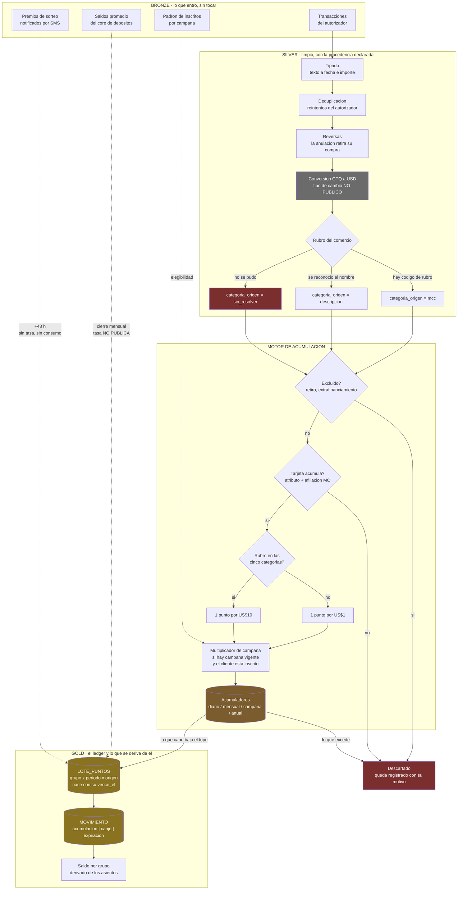

# 01 · El flujo del dato

De un consumo a un saldo consultable. Parte de la
[arquitectura](../README.md).

Las capas son Bronze, Silver y Gold. No se eligen por moda: el problema del
encargo es de explicabilidad, y explicar un saldo exige que existan una copia
intacta de lo que entró, una versión limpia que declare qué le pasó a cada
fila, y una tabla de negocio construida solo a partir de la anterior.

## Lo que el diagrama hace explícito

**Las flechas punteadas entran al ledger sin pasar por el motor.** El saldo
promedio y los sorteos no se acumulan: se asientan. No hay rubro que resolver
ni tope que consultar. Eso las hace más simples y a la vez más frágiles: son
las dos vías que no se pueden rederivar si se pierde su origen.

**`categoria_origen` no es metadato.** Es la columna que dice si el rubro del
comercio se supo de verdad o se dedujo del texto. Tiene que sobrevivir hasta
Gold, porque de ella depende si se aplicó la tasa base o la reducida, y entre
una y otra hay un factor de diez. En un programa donde el error de rubro cuesta
un 10%, esta columna sería una curiosidad; aquí decide un orden de magnitud.

**Hay tres salidas al descarte, y las tres son distintas.** Una exclusión de
producto, una tarjeta que no acumula y un consumo que excedió el tope no son lo
mismo, aunque los tres terminen en cero puntos. Un cliente que reclama merece
saber cuál de los tres le pasó, y el sistema solo puede responderlo si lo
escribió en el momento.

**El tope se aplica al final, no al principio.** El cálculo se hace completo y
el acumulador recorta. Es la única forma de poder decirle al cliente «ganaste
X, se te acreditaron Y, el resto excedió tu tope anual» en lugar de
simplemente acreditarle Y sin explicación.

## Lo que el diagrama no resuelve

El nodo `Conversion GTQ a USD` está en gris porque es un hueco, no un
componente. La tasa se define en dólares y el consumo se liquida en quetzales,
pero ninguna fuente pública dice con qué tipo de cambio ni de qué fecha. Todo
lo que está a su derecha depende de ese valor. Ver
[H-4](../../report/03-hallazgos.md#h-4--la-tasa-se-define-en-dólares-el-consumo-se-liquida-en-quetzales)
y la pregunta P-3.
