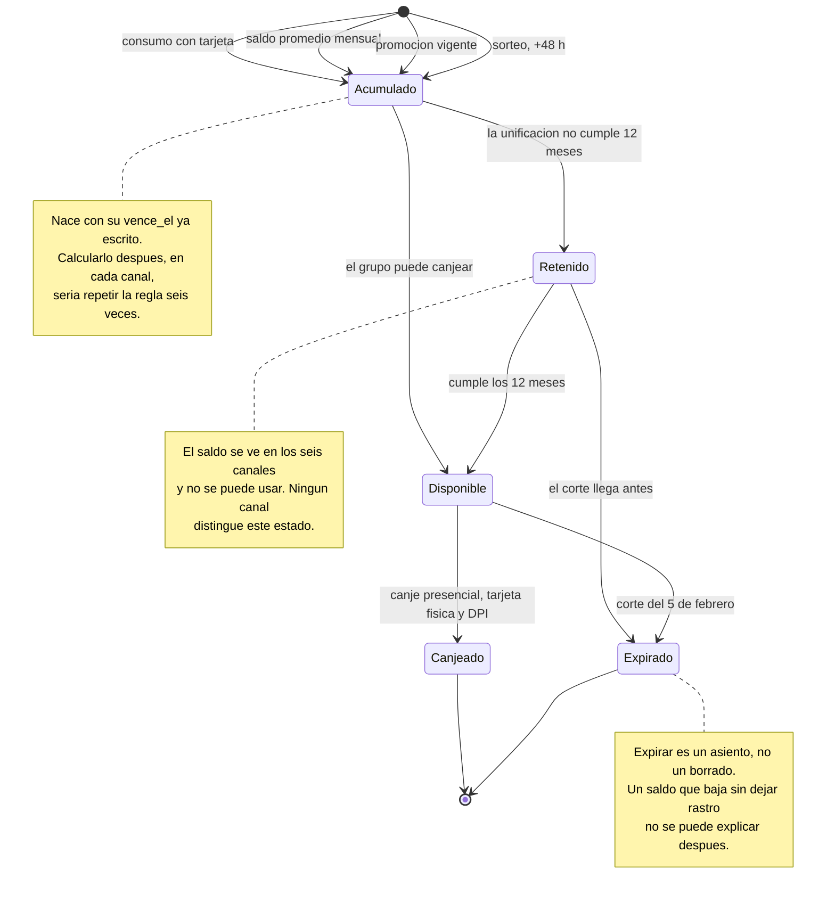

# 02 · El ciclo de vida de un punto

Qué le pasa a un punto desde que nace hasta que sale del sistema. Parte de la
[arquitectura](../README.md).

El sujeto de este diagrama no es el punto suelto: es el **lote**. Un lote son
los puntos que un grupo familiar acumuló en un mes desde un origen, y es el
grano mínimo que permite responder las dos preguntas que el programa hace todos
los días —cuándo vence esto y cuánto vale— sin adivinar.

## Los tres tramos que importan

### De Acumulado a Retenido: el saldo que se ve y no se puede usar

La unificación familiar exige una permanencia mínima de doce meses antes de que
el titular pueda canjear. Durante ese año, el grupo tiene saldo, lo ve en los
seis canales de consulta, y no puede ejercerlo.

Ninguna fuente pública sugiere que los canales distingan este estado. Si no lo
hacen, el cliente se entera en el mostrador, que es el peor lugar posible para
enterarse.

**Y hay un caso peor**: un lote puede entrar en `Retenido` y expirar sin haber
pasado nunca por `Disponible`. Un grupo que se unifica en marzo y acumula ese
mismo año tiene puntos que llegan al corte sin haber sido canjeables un solo
día. No se pudo verificar si el sistema real permite esto —haría falta saber si
la retención aplica al saldo trasladado o a todo el saldo del grupo— pero es
una pregunta que vale la pena hacerle al cliente.

### De Disponible a Expirado: el corte, no el aniversario

El corte es anual y en fecha fija: el 5 de febrero se lleva todo lo acumulado
durante un año calendario determinado. No es una cuenta de 24 meses desde cada
consumo.

Por eso este diagrama tiene una sola transición a `Expirado` desde cada estado,
y no una transición por lote con su propio reloj: **todos los lotes de un mismo
año se extinguen el mismo día**. Eso simplifica muchísimo la operación —un
trabajo por año en lugar de un vencimiento continuo— y a cambio produce la
asimetría de vigencia documentada en
[H-3](../../report/03-hallazgos.md#h-3--dos-años-de-vigencia-son-entre-13-y-25-meses-según-el-mes-de-compra).

Qué lote se consume primero al canjear no es público, y decide cuánto pierde un
cliente en cada corte. Es la pregunta P-4.

### De Disponible a Canjeado: el único estado que cambia por una persona

Todas las demás transiciones las ejecuta el sistema: un cierre de mes, un
trabajo anual, un cumplimiento de plazo. Esta la ejecuta alguien que va a un
centro de canje con su tarjeta física y su documento de identificación.

Es el único punto del ciclo de vida que depende de una gestión presencial, y es
justo el que convierte el programa en valor percibido. Ver
[H-8](../../report/03-hallazgos.md#h-8--seis-canales-consultan-el-saldo-uno-solo-lo-ejecuta-y-es-presencial).

## Por qué expirar tiene que dejar asiento

Es la decisión de diseño más barata de este caso y la que más problemas evita.

Si expirar se implementa como «poner el saldo del lote en cero», el sistema
pierde la capacidad de responder la pregunta que más recibe un programa de
puntos: *¿por qué bajó mi saldo?* Con un asiento de expiración —fecha, lote,
cantidad, motivo— la respuesta es una consulta. Sin él, es una reconstrucción
manual que alguien tiene que hacer a mano cada vez.

El mismo razonamiento aplica al canje parcial de un lote, al ajuste manual y a
la reversa de una acreditación. En un sistema cuyos diseñadores ya no están, el
asiento es lo único que sobrevive a la salida de la gente.
