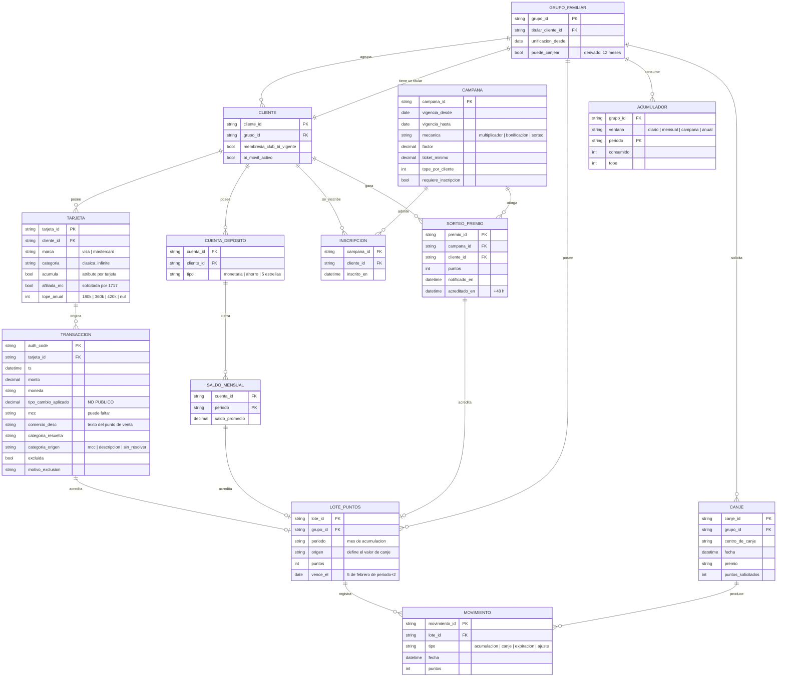

# 03 · El modelo de datos

Qué entidades tienen que existir para que las reglas públicas se puedan
cumplir. Parte de la [arquitectura](../README.md).

Como el resto de estos diagramas, es una **deducción**: el modelo que el
comportamiento publicado obliga a que exista, no un esquema verificado en
producción.

## Las cinco decisiones del modelo

### 1. `LOTE_PUNTOS` cuelga del grupo, no del cliente

Es la traducción directa de la unificación familiar. El saldo pertenece al
grupo y solo el titular lo ejerce, así que la clave foránea natural es
`grupo_id`. Colgarlo del cliente obligaría a re-agregar en cada consulta y
abriría la puerta a contar puntos que nadie puede canjear.

`CLIENTE` sigue existiendo porque la elegibilidad es individual: la membresía
Club Bi, el servicio Bi Móvil y la inscripción a campañas son del cliente, no
del grupo.

### 2. `origen` vive en el lote y no se deriva de nada

Es la columna que sostiene el hallazgo central. Si la conversión a millas varía
según el producto que generó el punto, el origen **es parte del valor**, no una
etiqueta descriptiva. Un lote sin origen es un lote que no se puede canjear a
millas.

Y no se puede reconstruir después: un lote de 2024 que perdió su origen no
tiene cómo recuperarlo si la transacción que lo generó ya se archivó.

### 3. `vence_el` se escribe al crear el lote

Podría calcularse al consultarlo —es una función del periodo— pero entonces la
regla del 5 de febrero viviría repetida en los seis canales de consulta, y basta
con que uno la implemente distinto para que el cliente vea dos fechas según
dónde mire. Escribirla una vez, en el origen, cuesta un campo.

### 4. `ACUMULADOR` es una entidad, no un `SUM()`

Las bases de promociones dejan ver cuatro ventanas conviviendo: tope diario,
tope mensual, tope por campaña y tope anual por categoría de tarjeta. Resolverlas
con agregaciones sobre el histórico es correcto y lento, y además no permite
responder «¿cuánto me queda de mi tope?», que es justo lo que un cliente
querría saber antes de comprar.

Su grano está declarado como `grupo_id`, pero **es la pregunta abierta P-1**: el
tope anual podría ser por tarjeta, por cliente o por grupo. Las tres opciones
dan saldos distintos para el mismo consumo, y esta tabla cambia según la
respuesta.

### 5. `MOVIMIENTO` es la única fuente del saldo

No hay campo `saldo` en ninguna entidad. El saldo de un grupo es la suma de sus
movimientos, y punto. Guardarlo además en una columna crea dos verdades que se
desincronizan, y el día que difieren nadie sabe cuál es la buena.

Esto es lo que hace que `expiracion` tenga que ser un tipo de movimiento y no
un borrado: si expirar no deja asiento, el saldo derivado deja de cuadrar con
la historia.

## Lo que falta en este modelo

- **Versionado de la elegibilidad.** `CLIENTE.membresia_club_bi_vigente` es un
  booleano del presente. Para recalcular una acreditación del año pasado haría
  falta saber cómo estaba ese booleano entonces. Sin historial, el recálculo es
  imposible y la auditoría también.
- **Trazabilidad de la campaña en el lote.** Un lote acredita desde una
  transacción, pero si hubo un multiplicador de campaña, el lote no dice cuál.
  Falta una referencia a `CAMPANA` para poder explicar por qué un consumo de
  Q100 dio el doble de lo esperado.
- **El tipo de cambio.** Está en `TRANSACCION` como campo, pero su origen no es
  público. Mientras no se sepa de dónde sale, es un campo cuyo contenido nadie
  puede verificar.
