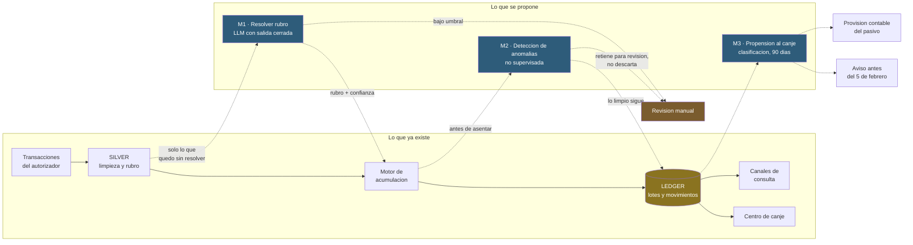

# 04 · Dónde entra el modelo

Los tres injertos de ML/AI/LLM, situados sobre el pipeline que ya existe. Parte
de la [arquitectura](../README.md).

El detalle de cada uno —qué datos necesita, qué métrica lo gobierna y qué
compuerta lo tumba— está en la
[propuesta](../../proposal/ml-ai-llm.md). Este diagrama solo responde *dónde*.

## Por qué están donde están

### M1 va *dentro* del pipeline, y los otros dos no

Es la diferencia que más conviene tener clara al presentar la propuesta.

**M1 resuelve el rubro del comercio**, y el rubro decide si se aplica 1 punto
por US$1 o 1 punto por US$10. Si M1 se equivoca, el cliente recibe un número
equivocado de puntos. Es un componente del camino crítico: sin él, el motor
calcula sobre un atributo incorrecto.

Por eso entra antes del motor, solo sobre las transacciones que la regla de
texto dejó sin resolver, y por eso devuelve **rubro más confianza**: por debajo
de un umbral, la fila va a revisión en lugar de acreditarse a ciegas.

**M2 y M3 son observadores.** Si M3 se equivoca, alguien recibe un aviso que no
necesitaba. Si M2 se equivoca, un lote espera una revisión. Ninguno de los dos
altera el saldo de un cliente por sí solo, y eso cambia por completo el nivel de
garantía que hay que exigirles antes de ponerlos a funcionar.

### M2 va antes del asiento, no después

Corregir un lote ya asentado es caro: hay que emitir un movimiento de ajuste,
explicárselo al cliente y resolver qué pasa si ya lo canjeó. Detectar la
anomalía antes de escribir el asiento convierte ese problema en una espera.

De ahí la flecha a `Revision manual` y no a un descarte. Un falso positivo que
bloquea puntos legítimos hace más daño que el fraude que evita, así que el
modelo retiene y una persona decide.

### M3 cuelga del ledger y sale del sistema

No alimenta ningún cálculo. Lee el ledger y produce dos cosas para consumo
humano: una estimación de cuánto del pasivo se va a realizar, y una lista de a
quién avisar antes del corte del 5 de febrero.

Que su salida no vuelva al pipeline es deliberado. Un modelo de propensión que
modificara saldos sería un modelo tomando decisiones sobre dinero del cliente.

## La regla que aplica a los tres

Ninguno entra sin superar a la referencia simple que ya existe hoy:

| Injerto | Referencia a batir |
|---|---|
| M1 · Rubro | La regla de texto actual, medida sobre las filas sin código de rubro |
| M2 · Anomalías | Un umbral fijo sobre puntos por quetzal |
| M3 · Propensión | Ordenar a los clientes por saldo |

Un modelo que no gana a su referencia es código que hay que mantener, servir y
monitorear a cambio de nada. La conclusión correcta en ese caso es no tener
modelo, y conviene decidirlo antes de construirlo.
